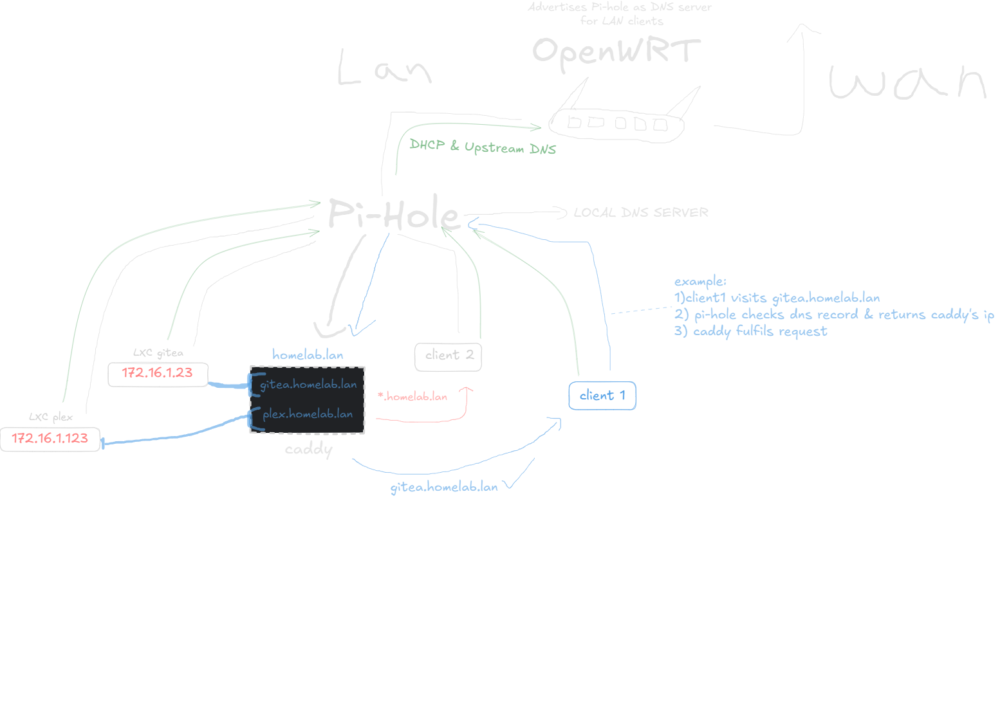

# My Homelab

Welcome to my Homelab repo! Here you can find my Docker composes & Guides for self-hosted related things.

# Table of Contents

- [Docker composes, configs & more](services/)
- [Mounting a NAS dataset in a Proxmox LXC](#mounting-a-nas-dataset-in-a-proxmox-lxc)
- [Local Domains](#local-domains)
- (MORE SOON)

# **Services in my Homelab**

#### *Proxmox VE*

- [**Gitea**](services/gitea) - local github
- [**Nextcloud**](services/nextcloud) - local cloud
- [**Immich**](services/immich) - photo/video storage
- [**Kiwix**](services/kiwix) - offline browser
- [**Komga**](services/komga) - manga reading
- [**Suwayomi**](services/suwayomi) - manga downloading
- [**Pihole**](services/pihole) -  Local Domains, Adblock
- [**Authentik**](services/authentik) - homelab authentication
- [**Caddy**](services/caddy) - reverse proxy
- [**Qbittorrent & Gluetun**](services/) - Torrenting
- [**Cyberchef**](services/cyberchef) - digital swiss army knife
- [**Ollama**](services/) - Mistral 7B (local LLM)

> [!NOTE] Most of these services are ran in an LXC (mostly Alpine my goat)

#### *OpenWrt* - *Router, Network isolation*

#### *TrueNAS* - *Network attached storage*

- 2x4TB - RAID1
- 1x3TB - STRIP
- 1x1TB - STRIP

# **Hardware**

- Thinkcentre 920q (i5-8500T, 32GB DDR4)
- Acer Veriton N4660G (i5-8500T, 8GB DDR4)
- Raspberry pi 4 (8GB)
- ASUS TUF-AX6000
- Netgear Gs108ge
- DeskPi 7.84" touch screen
- 2x4TB WD red HDD
- 1x3TB WD red HDD
- 1x1TB Seagate HDD

---

# Mounting a NAS dataset in a Proxmox LXC

for this example we will be using an SMB dataset we created in TrueNas named "Manga"  

now the SMB share exists as `//{NAS_IP}/Manga`

We will be using **Proxmox** as a Middle man between the SMB dataset and the LXC.  
So lets start by creating a NAS directory in /mnt in our Proxmox VE.

```
mkdir -p /mnt/nas/manga
```

we can create a new directory for every dataset we make for our NAS for ease of mounting

### ==*LXC group*==

inside the target LXC make a new group with `GID 10000` so we don't face permission issues

```
groupadd -g 10000 LXC_share
```

`addgroup` on alpine

```
mkdir -p /mnt/manga
```

### ==*Mounting the SMB dataset to Proxmox host*==

Now back in the proxmox VE shell lets edit the fstab (NOT in the LXC)

```
vim /etc/fstab
```

add this line at the bottom to connect to and mount the NAS dataset onto our proxmox host

```
//{NAS_IP}/Manga /mnt/nas/manga cifs _netdev,x-systemd.automount,noatime,uid=100000,gid=110000,dir_mode=0770,file_mode=0770,user={USER},pass={PASSWORD} 0 0
```

*replace {NAS_IP} with your smb server*

### ==Mounting the SMB dataset in the LXC==

replace number with your LXC id

```
vim /etc/pve/lxc/101.conf
```

add this at the end of the file

```
mp0: /mnt/nas/manga,mp=/mnt/manga,acl=1
```

### ==*Done! now the NAS SMB dataset is available to us inside the LXC*==

```
ls -lha /mnt/
total 8.0K
drwxr-xr-x  3 root root  4.0K Oct 22 01:20 .
drwxr-xr-x 18 root root  4.0K Jan 12 01:08 ..
drwxrwx---  2 root 10000    0 Jan 13 00:45 manga
```

you can now bind it to a volume in a docker compose for example or use it for any other purpose!

---

# Local domains

*There seems to be a lack of guides on local domains especially when using OpenWrt so hopefully this helps...*

(Soon...)



