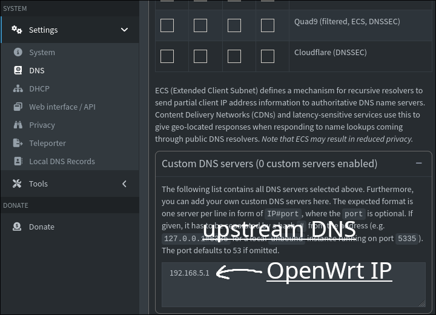
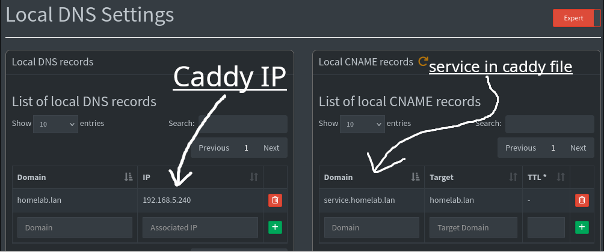

# Reverse proxy HTTPS and local domains

*There seems to be a lack of guides on local domains especially when using OpenWrt so hopefully this helps...*
I'm using OpenWrt as secondary NAT router to isolate the homelab from the rest of my network.


> **Flow**: LAN client → `service.homelab.lan` → Pi-hole resolves to Caddy IP → Caddy connects securely to LXC → Response forwarded to client

### First set up Pi-hole in your LAN

Pi-hole is a great network-wide adblocker but many people neglect it's ability to also act as a local DNS server. You can use my [docker compose](services/pihole).

We'll come back to Pi-hole later to make some changes in the web UI

### Advertise OpenWrt clients to use Pi-hole as a DNS server

> **Note**: Windows devices may require manual DNS configuration to use Pi-hole.

SSH into your OpenWrt router and configure DNS:

```sh
ssh root@{OPENWRT_IP}
echo "dhcp-option=6,{PI-HOLE IP}" >> /etc/dnsmasq.conf #remove brackets and add pihole ip
/etc/init.d/dnsmasq restart
```

All clients connected to OpenWrt will now use Pi-hole for DNS, also enabling ad-blocking immediately.

### Caddy for the reverse proxy and HTTPS

You can find my quick guide on setting up Caddy for alpine [here](services/caddy)

> **Security Note**: `tls internal` is fine for local networks as traffic never leaves your trusted environment.

```yml
# Example Caddyfile configuration
service.homelab.lan {
    tls internal
    reverse_proxy {LXC-IP}:8080  # Replace with your service's LXC IP
```

### Final steps in Pi-hole's WebUI

Access Pi-hole and configure upstream DNS to openwrt (or another server if you prefer)



head to **Settings -> Local DNS Records**. Add a DNS record with your domain of choice and make it point to Caddy's IP.

Now for each service you can add a CNAME as shown in the screenshot below


tips:

- chose a TLD that cannot exist: `.lan` `.home` `.local` `.lab`
- install the Caddy root certificate and install it on the browser you use to browse your homelab

#### Done! now we can access <https://service.homelab.lan> in our browser

